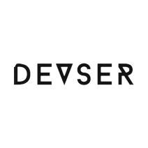

<p align="center">
  
  <br>
  <i>This project was made just to put my spare time in, In a nutshell, I make any idea comes to my mind.<br />
    <br> You can name it a portfolio if you want.</i>
  <br>
</p>

<p align="center">
  <a href="https://console-devser.firebaseapp.com"><strong>Website</strong></a>
  <br>
</p>

<p align="center">
  This project was bootstrapped with <a href="https://github.com/facebook/create-react-app">Create React App!</a>
  <br>
</p>

<p align="center">
  <a href="https://img.shields.io/github/license/Dev2ser/devser">
    
  </a>&nbsp;
  <a href="https://app.circleci.com/pipelines/github/Dev2ser/devser">
    
  </a>&nbsp;
  <a href="https://github.com/Dev2ser/devser/actions?query=workflow%3ACodeQL">
    
  </a>&nbsp;
  <a href="https://www.codefactor.io/repository/github/dev2ser/devser">
    
  </a>&nbsp;
  <a href="https://gitlocalize.com/repo/5485/whole_project?utm_source=badge">
    
  </a>
</p>

<hr>

You can also view this in other languages: English | [عربية](https://github.com/Dev2ser/devser/blob/master/translations/lang_ar.md) | [Española](https://github.com/Dev2ser/devser/blob/master/translations/lang_es.md) | [Française](https://github.com/Dev2ser/devser/blob/master/translations/lang_fr.md) | [中文](https://github.com/Dev2ser/devser/blob/master/translations/lang_zh.md)

<hr>

- [Prerequisites](#prerequisites)
- [Run Locally](#run-locally)
- [Environment Variables](#environment-variables)
- [Running Tests](#running-tests)
- [Available Scripts](#available-scripts)
- [Contributing](#contributing)
- [License](#license)

## Prerequisites

- Node version 12.13 or higher.
- Yarn.
- Git.
- Python version 3.6.3.

## Run Locally

You can get the project's source code in 3 different ways:

1. cloning it with HTTPS:<br />
   `git clone https://github.com/Dev2ser/devser.git`

2. or with SSH:<br />
   `git clone git@github.com:Dev2ser/devser.git`

3. or by downloading the source code!

After cloning/downloading the project's source code, run the following command in the root folder to install the project's dependencies:

```bash
yard add
```

Then to run the code, execute the following command:

```bash
yarn start
```

## Environment Variables

To run this project, you will need to add the following environment variables to your .env file.<br />
you will need to create a project at [Firebase](https://firebase.google.com/) to get these environment variables.

`API_KEY`

`AUTH_DOMAIN`

`DATABASE_URL`

`PROJECT_ID`

`STORAGE_BUCKET`

`MESSAGING_SENDER_ID`

`APP_ID`

`MEASUREMENT_ID`

## Running Tests

To run tests, run the following command:

```bash
  yarn run test
```

## Available Scripts

In the project directory, you can run:

### `yarn run python:git`

Runs the python application located in the python folder.

### `yarn run analyze`

Generates a treemap visualization to help you debug where all the code is coming from.

### `yarn start`

Runs the app in the development mode.<br />
Open [http://localhost:3000](http://localhost:3000) to view it in the browser.

The page will reload if you make edits.<br />
You will also see any lint errors in the console.

### `yarn run storybook`

Runs the storybook environment.<br />
Open [http://localhost:9009](http://localhost:9009) to view it in the browser.

### `yarn test`

Launches the test runner in the interactive watch mode.<br />
See the section about [running tests](https://facebook.github.io/create-react-app/docs/running-tests) for more information.

### `yarn run build`

Builds the app for production to the `build` folder.<br />
It correctly bundles React in production mode and optimizes the build for the best performance.

The build is minified and the filenames include the hashes.<br />

### `yarn run build:tailwind`

Builds the tailwind source code.<br />
Don't use it manually, Other scripts use it automatically.

### `yarn run build:storybook`

Builds all `.stories.js` files.

### `yarn run deploy:github`

Deploys all files in `/docs` to https://dev2ser.github.io/devser.

### `yarn run deploy:firebase`

Deploys the project to [firebase](https://console-devser.firebaseapp.com).

## Contributing

If you want to contribute simply get the source code [(Guide)](https://github.com/Dev2ser/devser#installation),
and do anything with it that you think is better and will improve the project, and create a pull request.<br />
It will be reviewed, if it's helpful in any way it will be merged.

Also, please read the [CONTRIBUTING](https://github.com/Dev2ser/devser/blob/master/CONTRIBUTING.md) Guide.

## License

This project uses [MIT's license](https://opensource.org/licenses/MIT).
